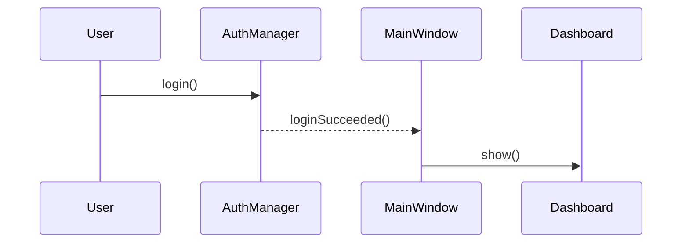
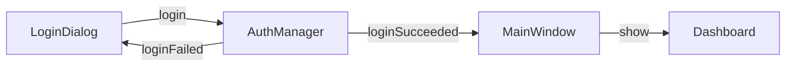
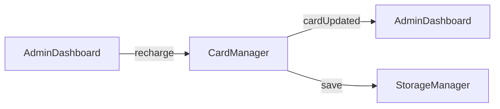
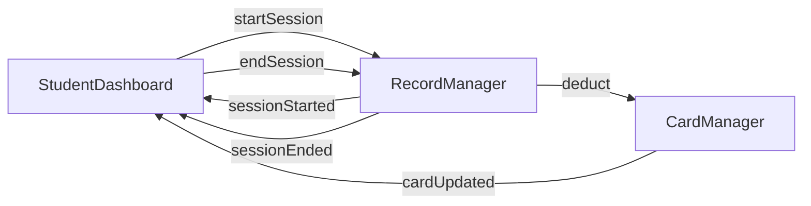

# 信号与槽

本文档描述系统中使用的 Qt 信号槽机制。

## 概述

系统使用 Qt 信号槽机制实现模块间的松耦合通信。当某个事件发生时，相关对象发射信号，连接的槽函数自动被调用。



## AuthManager 信号

### loginSucceeded

登录成功时发射。

```cpp
void loginSucceeded(UserRole role, const QString& cardId);
```

**参数**：

- `role` - 用户角色（Student/Admin）
- `cardId` - 卡号（管理员登录时为空）

**典型连接**：

```cpp
connect(authManager, &AuthManager::loginSucceeded,
        this, &MainWindow::onLoginSucceeded);
```

### loginFailed

登录失败时发射。

```cpp
void loginFailed(LoginResult result);
```

**参数**：

- `result` - 失败原因

**典型连接**：

```cpp
connect(authManager, &AuthManager::loginFailed,
        loginDialog, &LoginDialog::onLoginFailed);
```

### loggedOut

用户登出时发射。

```cpp
void loggedOut();
```

**典型连接**：

```cpp
connect(authManager, &AuthManager::loggedOut,
        this, &MainWindow::onLoggedOut);
```

## CardManager 信号

### cardsChanged

卡数据发生变更时发射（添加、删除、批量更新）。

```cpp
void cardsChanged();
```

**典型连接**：

```cpp
connect(cardManager, &CardManager::cardsChanged,
        adminDashboard, &AdminDashboard::refreshCardList);
```

### cardUpdated

单张卡更新时发射。

```cpp
void cardUpdated(const QString& cardId);
```

**参数**：

- `cardId` - 更新的卡号

**典型连接**：

```cpp
connect(cardManager, &CardManager::cardUpdated,
        studentDashboard, &StudentDashboard::refreshCardInfo);
```

## RecordManager 信号

### recordsChanged

记录数据变更时发射。

```cpp
void recordsChanged(const QString& cardId);
```

**参数**：

- `cardId` - 相关卡号

**典型连接**：

```cpp
connect(recordManager, &RecordManager::recordsChanged,
        recordTable, &RecordTableWidget::refresh);
```

### sessionStarted

上机开始时发射。

```cpp
void sessionStarted(const QString& cardId, const QString& location);
```

**参数**：

- `cardId` - 卡号
- `location` - 上机地点

**典型连接**：

```cpp
connect(recordManager, &RecordManager::sessionStarted,
        studentDashboard, &StudentDashboard::onSessionStarted);
```

### sessionEnded

上机结束时发射。

```cpp
void sessionEnded(const QString& cardId, double cost);
```

**参数**：

- `cardId` - 卡号
- `cost` - 本次费用

**典型连接**：

```cpp
connect(recordManager, &RecordManager::sessionEnded,
        studentDashboard, &StudentDashboard::onSessionEnded);
```

## 信号连接示例

### MainWindow 中的连接

```cpp
void MainWindow::setupConnections() {
    // 登录成功
    connect(m_authManager, &AuthManager::loginSucceeded,
            this, [this](UserRole role, const QString& cardId) {
        if (role == UserRole::Admin) {
            showAdminDashboard();
        } else {
            showStudentDashboard(cardId);
        }
    });

    // 登出
    connect(m_authManager, &AuthManager::loggedOut,
            this, &MainWindow::showWelcomePage);

    // 卡数据变更
    connect(m_cardManager, &CardManager::cardsChanged,
            m_adminDashboard, &AdminDashboard::refreshCardList);
}
```

### AdminDashboard 中的连接

```cpp
void AdminDashboard::setupConnections() {
    // 充值按钮
    connect(m_rechargeBtn, &ElaPushButton::clicked,
            this, &AdminDashboard::onRechargeClicked);

    // 卡选择变化
    connect(m_cardTable, &QTableWidget::itemSelectionChanged,
            this, &AdminDashboard::onCardSelectionChanged);

    // 上机结束更新统计
    connect(m_recordManager, &RecordManager::sessionEnded,
            this, &AdminDashboard::updateStatistics);
}
```

### StudentDashboard 中的连接

```cpp
void StudentDashboard::setupConnections() {
    // 开始上机
    connect(m_startBtn, &ElaPushButton::clicked,
            this, &StudentDashboard::onStartSession);

    // 结束上机
    connect(m_endBtn, &ElaPushButton::clicked,
            this, &StudentDashboard::onEndSession);

    // 会话结束更新界面
    connect(m_recordManager, &RecordManager::sessionEnded,
            this, [this](const QString& cardId, double cost) {
        if (cardId == m_currentCardId) {
            refreshSessionStatus();
            refreshStatistics();
            showCostMessage(cost);
        }
    });
}
```

## 信号流程图

### 登录流程



### 充值流程



### 上机流程



## 下一步

- [开发环境](../development/environment.md) - 配置开发环境
- [代码规范](../development/code-style.md) - 了解编码规范
