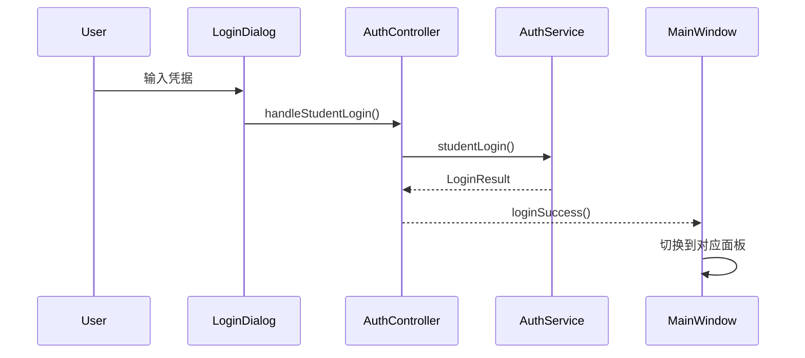
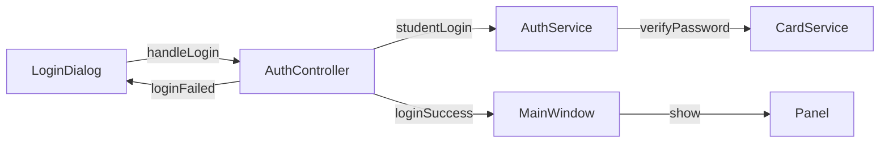
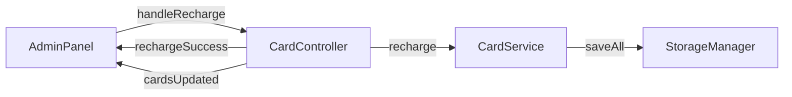
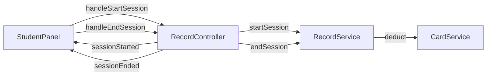

# 信号与槽

本文档描述系统中使用的 Qt 信号槽机制。

## 概述

系统使用 Qt 信号槽机制实现模块间的松耦合通信。当某个事件发生时，相关对象发射信号，连接的槽函数自动被调用。



## AuthController 信号

### loginSuccess

登录成功时发射。

```cpp
void loginSuccess(UserRole role, const QString& cardId, const QString& userName);
```

**参数**：

- `role` - 用户角色（Student/Admin）
- `cardId` - 卡号（管理员登录时为空）
- `userName` - 用户名称

**典型连接**：

```cpp
connect(m_authController, &AuthController::loginSuccess,
        this, &MainWindow::onLoginSuccess);
```

### loginFailed

登录失败时发射。

```cpp
void loginFailed(LoginResult result, const QString& message);
```

**参数**：

- `result` - 失败原因枚举
- `message` - 错误消息

**典型连接**：

```cpp
connect(m_authController, &AuthController::loginFailed,
        loginDialog, &LoginDialog::onLoginFailed);
```

### logoutSuccess

用户登出时发射。

```cpp
void logoutSuccess();
```

**典型连接**：

```cpp
connect(m_authController, &AuthController::logoutSuccess,
        this, &MainWindow::onLogoutSuccess);
```

### passwordError / cardFrozen

密码错误或卡被冻结时发射。

```cpp
void passwordError(int remainingAttempts);
void cardFrozen(const QString& cardId);
```

## CardController 信号

### cardsUpdated

卡数据发生变更时发射（添加、删除、批量更新）。

```cpp
void cardsUpdated();
```

**典型连接**：

```cpp
connect(m_cardController, &CardController::cardsUpdated,
        adminPanel, &AdminPanel::refreshCardList);
```

### cardUpdated

单张卡更新时发射。

```cpp
void cardUpdated(const QString& cardId);
```

**参数**：

- `cardId` - 更新的卡号

**典型连接**：

```cpp
connect(m_cardController, &CardController::cardUpdated,
        studentPanel, &StudentPanel::refreshCardInfo);
```

### rechargeSuccess / rechargeFailed

充值操作结果。

```cpp
void rechargeSuccess(const QString& cardId, double newBalance);
void rechargeFailed(const QString& message);
```

### cardCreated / cardCreateFailed

创建卡操作结果。

```cpp
void cardCreated(const QString& cardId);
void cardCreateFailed(const QString& message);
```

## RecordController 信号

### recordsUpdated

记录数据变更时发射。

```cpp
void recordsUpdated(const QString& cardId);
```

**参数**：

- `cardId` - 相关卡号

**典型连接**：

```cpp
connect(m_recordController, &RecordController::recordsUpdated,
        recordTable, &RecordTableWidget::refresh);
```

### sessionStarted / sessionStartFailed

上机开始结果。

```cpp
void sessionStarted(const QString& cardId, const QString& location);
void sessionStartFailed(const QString& message);
```

**参数**：

- `cardId` - 卡号
- `location` - 上机地点
- `message` - 错误消息

**典型连接**：

```cpp
connect(m_recordController, &RecordController::sessionStarted,
        studentPanel, &StudentPanel::onSessionStarted);
```

### sessionEnded / sessionEndFailed

上机结束结果。

```cpp
void sessionEnded(const QString& cardId, double cost, int duration);
void sessionEndFailed(const QString& message);
```

**参数**：

- `cardId` - 卡号
- `cost` - 本次费用
- `duration` - 上机时长（分钟）
- `message` - 错误消息

**典型连接**：

```cpp
connect(m_recordController, &RecordController::sessionEnded,
        studentPanel, &StudentPanel::onSessionEnded);
```

## 信号连接示例

### MainWindow 中的连接

```cpp
void MainWindow::setupConnections() {
    auto* authController = m_mainController->authController();

    // 登录成功
    connect(authController, &AuthController::loginSuccess,
            this, [this](UserRole role, const QString& cardId, const QString& userName) {
        if (role == UserRole::Admin) {
            showAdminPanel();
        } else {
            showStudentPanel(cardId);
        }
    });

    // 登出
    connect(authController, &AuthController::logoutSuccess,
            this, &MainWindow::showWelcomePage);
}
```

### AdminPanel 中的连接

```cpp
void AdminPanel::setupConnections() {
    // 充值按钮
    connect(m_rechargeBtn, &ElaPushButton::clicked,
            this, &AdminPanel::onRechargeClicked);

    // 卡选择变化
    connect(m_cardTable->selectionModel(), &QItemSelectionModel::selectionChanged,
            this, &AdminPanel::onCardSelectionChanged);

    // 卡数据变更
    connect(m_cardController, &CardController::cardsUpdated,
            this, &AdminPanel::refreshCardList);

    // 充值结果
    connect(m_cardController, &CardController::rechargeSuccess,
            this, &AdminPanel::onRechargeSuccess);
}
```

### StudentPanel 中的连接

```cpp
void StudentPanel::setupConnections() {
    // 开始上机
    connect(m_startBtn, &ElaPushButton::clicked,
            this, &StudentPanel::onStartSession);

    // 结束上机
    connect(m_endBtn, &ElaPushButton::clicked,
            this, &StudentPanel::onEndSession);

    // 会话结束更新界面
    connect(m_recordController, &RecordController::sessionEnded,
            this, [this](const QString& cardId, double cost, int duration) {
        if (cardId == m_currentCardId) {
            refreshSessionStatus();
            refreshStatistics();
            showCostMessage(cost, duration);
        }
    });

    // 记录更新
    connect(m_recordController, &RecordController::recordsUpdated,
            this, &StudentPanel::refreshRecordTable);
}
```

## 信号流程图

### 登录流程



### 充值流程



### 上机流程



## 下一步

- [开发环境](../development/environment.md) - 配置开发环境
- [代码规范](../development/code-style.md) - 了解编码规范
