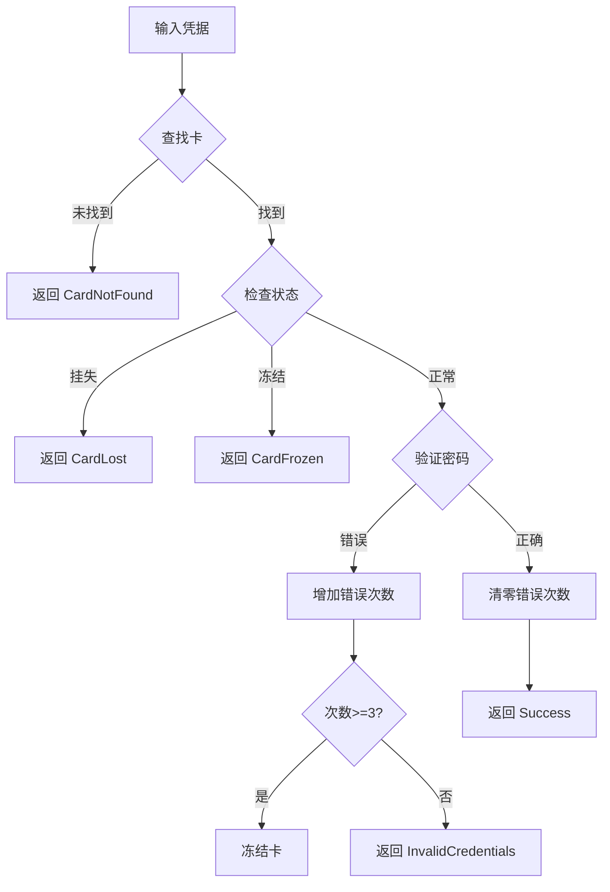

# MVC 模块详解

本文档详细介绍系统的 Model、View、Controller 各层模块。

## 类型定义（Types.h）

位于 `src/model/Types.h`，定义系统中使用的枚举类型和常量。

### 用户角色

```cpp
enum class UserRole {
    Student,  // 学生
    Admin     // 管理员
};
```

### 卡状态

```cpp
enum class CardState {
    Normal = 0,   // 正常
    Lost = 1,     // 挂失
    Frozen = 2    // 冻结
};
```

### 会话状态

```cpp
enum class SessionState {
    Offline = 0,  // 离线/已结束
    Online = 1    // 上机中
};
```

### 登录结果

```cpp
enum class LoginResult {
    Success,             // 登录成功
    InvalidCredentials,  // 密码错误
    CardNotFound,        // 卡号不存在
    CardLost,            // 卡已挂失
    CardFrozen,          // 卡已冻结
    AlreadyLoggedIn      // 已经登录
};
```

### 全局常量

| 常量                       | 值         | 说明             |
| -------------------------- | ---------- | ---------------- |
| `COST_PER_HOUR`            | 1.0        | 每小时费用（元） |
| `DEFAULT_ADMIN_PASSWORD`   | "admin123" | 默认管理员密码   |
| `DEFAULT_STUDENT_PASSWORD` | "123456"   | 默认学生密码     |
| `MAX_LOGIN_ATTEMPTS`       | 3          | 最大登录尝试次数 |

### 辅助函数

```cpp
// 状态转换为中文字符串
QString cardStateToString(CardState state);
QString sessionStateToString(SessionState state);
QString loginResultToString(LoginResult result);
```

---

## Model 层 - 实体类 (entities/)

### Card 类

校园卡实体类，位于 `src/model/entities/Card.h`。

#### 属性

| 属性              | 类型        | 说明             |
| ----------------- | ----------- | ---------------- |
| `m_cardId`        | `QString`   | 卡号（唯一标识） |
| `m_name`          | `QString`   | 持卡人姓名       |
| `m_studentId`     | `QString`   | 学号             |
| `m_totalRecharge` | `double`    | 累计充值金额     |
| `m_balance`       | `double`    | 当前余额         |
| `m_state`         | `CardState` | 卡状态           |
| `m_loginAttempts` | `int`       | 密码错误次数     |
| `m_password`      | `QString`   | 登录密码         |

#### 主要方法

```cpp
// 充值
bool recharge(double amount);

// 扣款
bool deduct(double amount);

// 挂失/解挂
void reportLost();
void cancelLost();

// 冻结/解冻
void freeze();
void unfreeze();

// 密码验证
bool verifyPassword(const QString& password) const;

// 检查是否可用
[[nodiscard]] bool isUsable() const;

// JSON 序列化
QJsonObject toJson() const;
static Card fromJson(const QJsonObject& json);
```

### Record 类

上机记录实体类，位于 `src/model/entities/Record.h`。

#### 属性

| 属性                | 类型           | 说明             |
| ------------------- | -------------- | ---------------- |
| `m_recordId`        | `QString`      | 记录 ID（UUID）  |
| `m_cardId`          | `QString`      | 关联卡号         |
| `m_date`            | `QString`      | 上机日期         |
| `m_startTime`       | `QDateTime`    | 开始时间         |
| `m_endTime`         | `QDateTime`    | 结束时间         |
| `m_durationMinutes` | `int`          | 上机时长（分钟） |
| `m_cost`            | `double`       | 上机费用         |
| `m_state`           | `SessionState` | 会话状态         |
| `m_location`        | `QString`      | 上机地点         |

#### 主要方法

```cpp
// 创建新记录
static Record createNew(const QString& cardId,
                        const QString& location);

// 结束会话
void endSession();

// 计算当前费用（不结束）
[[nodiscard]] double calculateCurrentCost() const;

// 检查是否在线
[[nodiscard]] bool isOnline() const;

// JSON 序列化
QJsonObject toJson() const;
static Record fromJson(const QJsonObject& json);
```

### User 类

用户实体类，位于 `src/model/entities/User.h`，表示当前登录用户。

#### 属性

| 属性       | 类型       | 说明                     |
| ---------- | ---------- | ------------------------ |
| `m_role`   | `UserRole` | 用户角色                 |
| `m_cardId` | `QString`  | 卡号（学生）/空（管理员） |
| `m_name`   | `QString`  | 用户名称                 |

---

## Model 层 - 业务服务 (services/)

### AuthService 类

认证业务服务，位于 `src/model/services/AuthService.h`，处理用户登录和会话管理。

#### 主要方法

```cpp
// 学生登录
LoginResult studentLogin(const QString& cardId, const QString& password);

// 管理员登录
LoginResult adminLogin(const QString& password);

// 登出
void logout();

// 会话状态查询
[[nodiscard]] bool isLoggedIn() const;
[[nodiscard]] UserRole currentRole() const;
[[nodiscard]] QString currentCardId() const;
[[nodiscard]] std::optional<User> currentUser() const;

// 管理员密码管理
bool verifyAdminPassword(const QString& password) const;
bool changeAdminPassword(const QString& oldPassword, const QString& newPassword);

// 卡状态预检
LoginResult checkCardLoginStatus(const QString& cardId) const;
int getRemainingLoginAttempts(const QString& cardId) const;
```

#### 信号

```cpp
signals:
    void loginSucceeded(UserRole role, const QString& cardId);
    void loginFailed(LoginResult result, const QString& cardId);
    void loggedOut();
    void passwordError(const QString& cardId, int remainingAttempts);
    void cardFrozen(const QString& cardId);
```

#### 登录流程



### CardService 类

卡业务服务，位于 `src/model/services/CardService.h`，处理卡片的 CRUD 操作和业务逻辑。

#### 主要方法

```cpp
// 初始化和保存
void initialize();
bool saveAll();

// 查询操作
[[nodiscard]] QList<Card> getAllCards() const;
[[nodiscard]] Card findCard(const QString& cardId) const;
[[nodiscard]] Card findCardByStudentId(const QString& studentId) const;
[[nodiscard]] bool cardExists(const QString& cardId) const;
[[nodiscard]] int cardCount() const;

// 创建新卡
bool createCard(const QString& cardId, const QString& name,
                const QString& studentId, double initialBalance = 0.0);
bool createCard(const Card& card);

// 充值/扣款
bool recharge(const QString& cardId, double amount);
bool deduct(const QString& cardId, double amount);
[[nodiscard]] double getBalance(const QString& cardId) const;

// 状态管理
bool reportLost(const QString& cardId);
bool cancelLost(const QString& cardId);
bool freeze(const QString& cardId);
bool unfreeze(const QString& cardId);

// 密码管理
[[nodiscard]] bool verifyPassword(const QString& cardId, const QString& password) const;
bool changePassword(const QString& cardId, const QString& oldPassword, const QString& newPassword);
bool resetPassword(const QString& cardId, const QString& newPassword);

// 登录尝试管理
int incrementLoginAttempts(const QString& cardId);
bool resetLoginAttempts(const QString& cardId);
[[nodiscard]] int getLoginAttempts(const QString& cardId) const;
```

#### 信号

```cpp
signals:
    void cardsChanged();
    void cardUpdated(const QString& cardId);
    void cardCreated(const QString& cardId);
    void balanceChanged(const QString& cardId, double newBalance);
    void cardStateChanged(const QString& cardId, CardState newState);
```

### RecordService 类

记录业务服务，位于 `src/model/services/RecordService.h`，管理上机会话和记录统计。

#### 主要方法

```cpp
// 初始化
void initialize();

// 会话管理
Record startSession(const QString& cardId, const QString& location);
double endSession(const QString& cardId);  // 返回费用

// 状态查询
[[nodiscard]] bool isOnline(const QString& cardId) const;
[[nodiscard]] Record getCurrentSession(const QString& cardId) const;
[[nodiscard]] double calculateCurrentCost(const QString& cardId) const;

// 记录查询
[[nodiscard]] QList<Record> getRecords(const QString& cardId) const;
[[nodiscard]] QList<Record> getRecordsByDate(const QString& cardId, const QString& date) const;
[[nodiscard]] QList<Record> getRecordsByDateRange(const QString& cardId,
                                                   const QString& startDate,
                                                   const QString& endDate) const;
[[nodiscard]] QList<Record> getRecordsByLocation(const QString& cardId, const QString& location) const;
[[nodiscard]] QList<Record> getAllRecordsByDate(const QString& date) const;
[[nodiscard]] QStringList getLocations(const QString& cardId) const;

// 个人统计
[[nodiscard]] int getTotalSessionCount(const QString& cardId) const;
[[nodiscard]] int getTotalDuration(const QString& cardId) const;
[[nodiscard]] double getTotalCost(const QString& cardId) const;
[[nodiscard]] QString getStatisticsSummary(const QString& cardId) const;

// 日统计（管理员功能）
[[nodiscard]] double getDailyIncome(const QString& date) const;
[[nodiscard]] int getDailySessionCount(const QString& date) const;
[[nodiscard]] int getDailyTotalDuration(const QString& date) const;
[[nodiscard]] int getOnlineCount() const;
```

#### 信号

```cpp
signals:
    void recordsChanged(const QString& cardId);
    void sessionStarted(const QString& cardId, const QString& location);
    void sessionEnded(const QString& cardId, double cost, int duration);
```

---

## Model 层 - 数据仓储 (repositories/)

### StorageManager 类

存储管理器，位于 `src/model/repositories/StorageManager.h`，单例模式，负责数据持久化。

#### 数据文件

```text
data/
├── cards.json          # 所有校园卡
├── admin.json          # 管理员密码
└── records/
    ├── C001.json       # C001 的上机记录
    ├── C002.json       # C002 的上机记录
    └── ...
```

#### 主要方法

```cpp
// 单例访问
static StorageManager& instance();

// 初始化
void setDataPath(const QString& path);
void initializeDataDirectory();
void createSampleData();

// 卡数据
QList<Card> loadAllCards();
void saveAllCards(const QList<Card>& cards);

// 记录数据
QList<Record> loadRecords(const QString& cardId);
void saveRecords(const QString& cardId, const QList<Record>& records);

// 管理员密码
QString loadAdminPassword();
void saveAdminPassword(const QString& password);

// 模拟数据
void generateMockData(int cardCount, int recordsPerCard);

// 导入导出
bool exportAllData(const QString& filePath);
bool importData(const QString& filePath, bool merge = false);
```

---

## Controller 层 (controller/)

### MainController 类

主控制器，位于 `src/controller/MainController.h`，管理所有 Service 和子 Controller。

#### 主要方法

```cpp
// 初始化
bool initialize(const QString& dataPath);

// 获取子控制器
[[nodiscard]] AuthController* authController() const;
[[nodiscard]] CardController* cardController() const;
[[nodiscard]] RecordController* recordController() const;

// 获取服务（用于 View 直接查询）
[[nodiscard]] CardService* cardService() const;
[[nodiscard]] RecordService* recordService() const;
[[nodiscard]] AuthService* authService() const;

// 数据管理
void generateMockData(int cardCount, int recordsPerCard);
bool exportData(const QString& filePath);
bool importData(const QString& filePath, bool merge);
void reloadData();
```

#### 信号

```cpp
signals:
    void initialized();
    void dataReloaded();
    void exportSuccess();
    void exportFailed(const QString& message);
    void importSuccess();
    void importFailed(const QString& message);
    void mockDataGenerated(int count);
```

### AuthController 类

认证控制器，位于 `src/controller/AuthController.h`，协调 View 和 AuthService。

#### 主要方法

```cpp
// 登录操作
void handleStudentLogin(const QString& cardId, const QString& password);
void handleAdminLogin(const QString& password);
void handleLogout();

// 状态查询
[[nodiscard]] bool isLoggedIn() const;
[[nodiscard]] UserRole currentRole() const;
[[nodiscard]] QString currentCardId() const;
[[nodiscard]] QString currentUserName() const;

// 密码管理
void handleChangeAdminPassword(const QString& oldPassword, const QString& newPassword);
```

#### 信号

```cpp
signals:
    void loginSuccess(UserRole role, const QString& cardId, const QString& userName);
    void loginFailed(LoginResult result, const QString& message);
    void logoutSuccess();
    void passwordError(int remainingAttempts);
    void cardFrozen(const QString& cardId);
    void adminPasswordChanged();
    void adminPasswordChangeFailed(const QString& message);
```

### CardController 类

卡控制器，位于 `src/controller/CardController.h`，协调 View 和 CardService。

#### 主要方法

```cpp
// 查询操作
[[nodiscard]] QList<Card> getAllCards() const;
[[nodiscard]] Card getCard(const QString& cardId) const;
[[nodiscard]] bool cardExists(const QString& cardId) const;
[[nodiscard]] QList<Card> searchCards(const QString& keyword) const;

// 创建操作
void handleCreateCard(const QString& cardId, const QString& name,
                      const QString& studentId, double initialBalance = 0.0);
void handleRegisterCard(const QString& cardId, const QString& name,
                        const QString& studentId, const QString& password);

// 充值扣款
void handleRecharge(const QString& cardId, double amount);
void handleDeduct(const QString& cardId, double amount);

// 状态管理
void handleReportLost(const QString& cardId);
void handleCancelLost(const QString& cardId);
void handleFreeze(const QString& cardId);
void handleUnfreeze(const QString& cardId);

// 密码管理
void handleChangePassword(const QString& cardId, const QString& oldPassword, const QString& newPassword);
void handleResetPassword(const QString& cardId, const QString& newPassword);
```

#### 信号

```cpp
signals:
    void cardCreated(const QString& cardId);
    void cardCreateFailed(const QString& message);
    void rechargeSuccess(const QString& cardId, double newBalance);
    void rechargeFailed(const QString& message);
    void deductSuccess(const QString& cardId, double newBalance);
    void deductFailed(const QString& message);
    void reportLostSuccess(const QString& cardId);
    void cancelLostSuccess(const QString& cardId);
    void freezeSuccess(const QString& cardId);
    void unfreezeSuccess(const QString& cardId);
    void passwordChanged(const QString& cardId);
    void passwordChangeFailed(const QString& message);
    void passwordReset(const QString& cardId);
    void cardsUpdated();
    void cardUpdated(const QString& cardId);
```

### RecordController 类

记录控制器，位于 `src/controller/RecordController.h`，协调 View 和 RecordService。

#### 主要方法

```cpp
// 上下机操作
void handleStartSession(const QString& cardId, const QString& location);
void handleEndSession(const QString& cardId);
[[nodiscard]] bool isOnline(const QString& cardId) const;
[[nodiscard]] Record getCurrentSession(const QString& cardId) const;
[[nodiscard]] double getCurrentCost(const QString& cardId) const;

// 记录查询
[[nodiscard]] QList<Record> getRecords(const QString& cardId) const;
[[nodiscard]] QList<Record> getRecordsByDateRange(const QString& cardId,
                                                   const QString& startDate,
                                                   const QString& endDate) const;
[[nodiscard]] QList<Record> getFilteredRecords(const QString& cardId,
                                                const QString& startDate,
                                                const QString& endDate,
                                                const QString& location) const;
[[nodiscard]] QList<Record> getAllRecordsByDate(const QString& date) const;

// 统计查询
[[nodiscard]] int getTotalSessionCount(const QString& cardId) const;
[[nodiscard]] int getTotalDuration(const QString& cardId) const;
[[nodiscard]] double getTotalCost(const QString& cardId) const;
[[nodiscard]] double getDailyIncome(const QString& date) const;
[[nodiscard]] int getDailySessionCount(const QString& date) const;
[[nodiscard]] int getOnlineCount() const;
```

#### 信号

```cpp
signals:
    void sessionStarted(const QString& cardId, const QString& location);
    void sessionStartFailed(const QString& message);
    void sessionEnded(const QString& cardId, double cost, int duration);
    void sessionEndFailed(const QString& message);
    void recordsUpdated(const QString& cardId);
```

---

## 下一步

- [UI 组件](ui-components.md) - 了解界面组件
- [数据模型](../api/data-models.md) - 查看 JSON 格式
