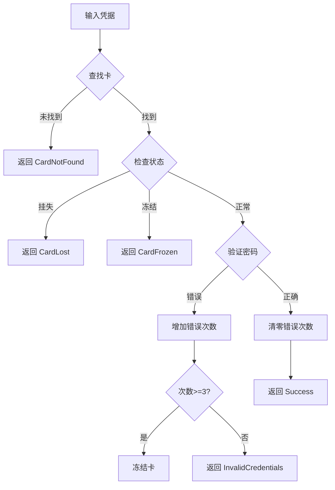

# 核心模块

本文档详细介绍系统核心业务逻辑层的各个模块。

## 类型定义（Types.h）

### 用户角色

```cpp
enum class UserRole {
    Student,  // 学生
    Admin     // 管理员
};
```

### 卡状态

```cpp
enum class CardState {
    Normal,   // 正常
    Lost,     // 挂失
    Frozen    // 冻结
};
```

### 会话状态

```cpp
enum class SessionState {
    Offline,  // 离线/已结束
    Online    // 上机中
};
```

### 全局常量

| 常量 | 值 | 说明 |
|------|------|------|
| `COST_PER_HOUR` | 1.0 | 每小时费用（元） |
| `DEFAULT_ADMIN_PASSWORD` | "admin123" | 默认管理员密码 |
| `MAX_LOGIN_ATTEMPTS` | 3 | 最大登录尝试次数 |

## Card 类

校园卡实体类，表示一张校园卡的完整信息。

### 属性

| 属性 | 类型 | 说明 |
|------|------|------|
| `m_cardId` | `QString` | 卡号（唯一标识） |
| `m_name` | `QString` | 持卡人姓名 |
| `m_studentId` | `QString` | 学号 |
| `m_totalRecharge` | `double` | 累计充值金额 |
| `m_balance` | `double` | 当前余额 |
| `m_state` | `CardState` | 卡状态 |
| `m_loginAttempts` | `int` | 密码错误次数 |
| `m_password` | `QString` | 登录密码 |

### 主要方法

```cpp
// 充值
bool recharge(double amount);

// 扣款
bool deduct(double amount);

// 挂失/解挂
void reportLost();
void cancelLost();

// 冻结/解冻
void freeze();
void unfreeze();

// 密码验证
bool verifyPassword(const QString& password) const;

// 检查是否可用
[[nodiscard]] bool isUsable() const;

// JSON 序列化
QJsonObject toJson() const;
static Card fromJson(const QJsonObject& json);
```

## Record 类

上机记录实体类，记录一次上机会话的完整信息。

### 属性

| 属性 | 类型 | 说明 |
|------|------|------|
| `m_recordId` | `QString` | 记录 ID（UUID） |
| `m_cardId` | `QString` | 关联卡号 |
| `m_date` | `QString` | 上机日期 |
| `m_startTime` | `QDateTime` | 开始时间 |
| `m_endTime` | `QDateTime` | 结束时间 |
| `m_durationMinutes` | `int` | 上机时长（分钟） |
| `m_cost` | `double` | 上机费用 |
| `m_state` | `SessionState` | 会话状态 |
| `m_location` | `QString` | 上机地点 |

### 主要方法

```cpp
// 创建新记录
static Record createNew(const QString& cardId, 
                        const QString& location);

// 结束会话
void endSession();

// 计算当前费用（不结束）
[[nodiscard]] double calculateCurrentCost() const;

// 检查是否在线
[[nodiscard]] bool isOnline() const;
```

### 费用计算

```cpp
double Record::calculateCurrentCost() const {
    if (m_state == SessionState::Offline) {
        return m_cost;
    }
    
    int minutes = m_startTime.secsTo(QDateTime::currentDateTime()) / 60;
    if (minutes < 1) minutes = 1;  // 最少 1 分钟
    
    return std::ceil(minutes) * (COST_PER_HOUR / 60.0);
}
```

## AuthManager 类

认证管理器，处理用户登录、登出和密码管理。

### 登录结果

```cpp
enum class LoginResult {
    Success,            // 登录成功
    InvalidCredentials, // 密码错误
    CardNotFound,       // 卡号不存在
    CardLost,           // 卡已挂失
    CardFrozen,         // 卡已冻结
    AlreadyLoggedIn     // 已经登录
};
```

### 主要方法

```cpp
// 学生登录
LoginResult studentLogin(const QString& cardId, 
                         const QString& password);

// 管理员登录
LoginResult adminLogin(const QString& password);

// 登出
void logout();

// 修改管理员密码
bool changeAdminPassword(const QString& oldPassword,
                         const QString& newPassword);

// 获取当前用户
[[nodiscard]] const User* currentUser() const;
[[nodiscard]] bool isLoggedIn() const;
```

### 信号

```cpp
signals:
    void loginSucceeded(UserRole role, const QString& cardId);
    void loginFailed(LoginResult result);
    void loggedOut();
```

### 登录流程



## CardManager 类

卡片管理器，负责卡片的 CRUD 操作和业务逻辑。

### 主要方法

```cpp
// 获取所有卡
[[nodiscard]] QList<Card> getAllCards() const;

// 按卡号查找
[[nodiscard]] std::optional<Card> findCard(const QString& cardId) const;

// 按学号查找
[[nodiscard]] std::optional<Card> findCardByStudentId(
    const QString& studentId) const;

// 创建新卡
bool createCard(const QString& cardId, const QString& name,
                const QString& studentId, double balance = 0.0);

// 充值
bool rechargeCard(const QString& cardId, double amount);

// 扣款
bool deductFromCard(const QString& cardId, double amount);

// 挂失/解挂
bool reportCardLost(const QString& cardId);
bool cancelCardLost(const QString& cardId);

// 冻结/解冻
bool freezeCard(const QString& cardId);
bool unfreezeCard(const QString& cardId);

// 重置密码
bool resetPassword(const QString& cardId, const QString& newPassword);
```

### 信号

```cpp
signals:
    void cardsChanged();
    void cardUpdated(const QString& cardId);
```

## RecordManager 类

记录管理器，管理上机会话和统计查询。

### 主要方法

```cpp
// 会话管理
bool startSession(const QString& cardId, const QString& location);
double endSession(const QString& cardId);  // 返回费用

// 状态查询
[[nodiscard]] bool isOnline(const QString& cardId) const;
[[nodiscard]] std::optional<Record> getCurrentSession(
    const QString& cardId) const;

// 记录查询
[[nodiscard]] QList<Record> getRecords(const QString& cardId) const;
[[nodiscard]] QList<Record> getRecordsByDate(
    const QString& cardId, const QString& date) const;
[[nodiscard]] QList<Record> getRecordsByDateRange(
    const QString& cardId, 
    const QString& startDate, 
    const QString& endDate) const;

// 统计
[[nodiscard]] int getTotalDuration(const QString& cardId) const;
[[nodiscard]] double getTotalCost(const QString& cardId) const;
[[nodiscard]] double getDailyIncome(const QString& date) const;
[[nodiscard]] QList<Record> getAllRecordsByDate(const QString& date) const;
```

### 信号

```cpp
signals:
    void recordsChanged(const QString& cardId);
    void sessionStarted(const QString& cardId, const QString& location);
    void sessionEnded(const QString& cardId, double cost);
```

## StorageManager 类

存储管理器，单例模式，负责数据持久化。

### 数据文件

```text
data/
├── cards.json          # 所有校园卡
├── admin.json          # 管理员密码
└── records/
    ├── C001.json       # C001 的上机记录
    ├── C002.json       # C002 的上机记录
    └── ...
```

### 主要方法

```cpp
// 单例访问
static StorageManager& instance();

// 卡数据
QList<Card> loadAllCards();
void saveAllCards(const QList<Card>& cards);

// 记录数据
QList<Record> loadRecords(const QString& cardId);
void saveRecords(const QString& cardId, const QList<Record>& records);

// 管理员密码
QString loadAdminPassword();
void saveAdminPassword(const QString& password);

// 初始化
void initializeDataDirectory();
void createSampleData();

// 模拟数据
void generateMockData(int cardCount, int recordsPerCard);

// 导入导出
bool exportAllData(const QString& filePath);
bool importData(const QString& filePath, bool merge = false);
```

## 下一步

- [UI 组件](ui-components.md) - 了解界面组件
- [数据模型](../api/data-models.md) - 查看 JSON 格式
