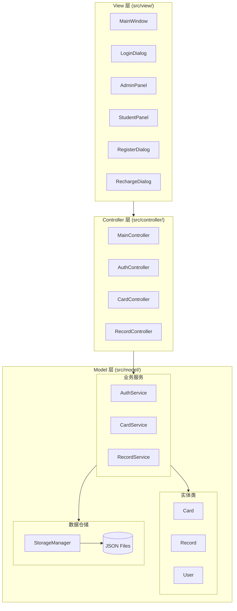
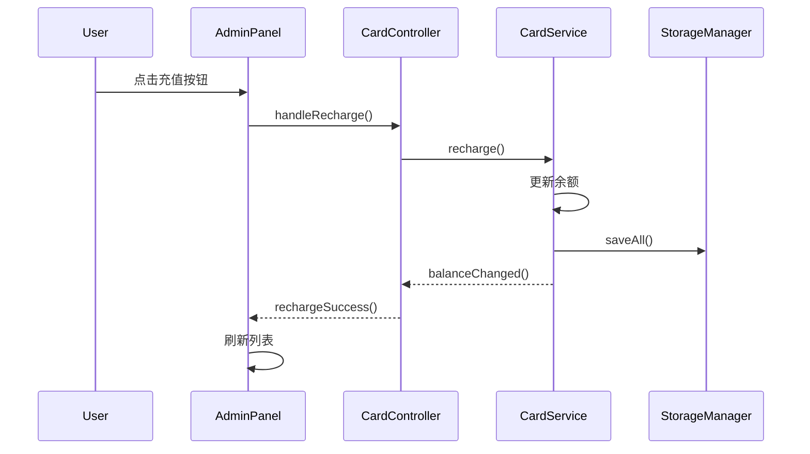
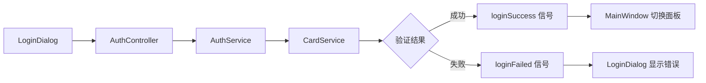
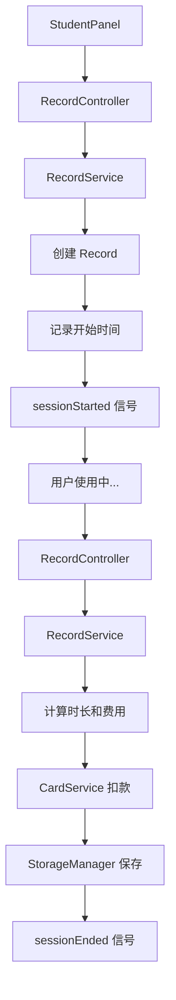

# 系统概述

本文档介绍校园卡管理系统的整体架构设计和核心设计理念。

## 架构概览

系统采用标准的 **MVC（Model-View-Controller）架构**设计，实现了关注点分离和模块化开发。



## 层次职责

### View 层（视图层）

负责用户界面展示和用户交互，不包含业务逻辑。

| 组件                | 职责                 |
| ------------------- | -------------------- |
| `MainWindow`        | 主窗口框架，页面切换 |
| `LoginDialog`       | 登录认证界面         |
| `RegisterDialog`    | 新卡注册界面         |
| `AdminPanel`        | 管理员控制面板       |
| `StudentPanel`      | 学生操作面板         |
| `RechargeDialog`    | 充值对话框           |
| `StatisticsWidget`  | 统计报表组件         |
| `RecordTableWidget` | 记录表格组件         |

### Controller 层（控制器层）

协调 View 和 Model 的交互，处理用户请求。

| 组件               | 职责                           |
| ------------------ | ------------------------------ |
| `MainController`   | 主控制器，管理所有 Service 和 Controller |
| `AuthController`   | 处理登录/登出请求             |
| `CardController`   | 处理卡管理请求               |
| `RecordController` | 处理上下机和记录查询请求     |

### Model 层（模型层）

包含数据和业务逻辑，分为三个子层：

#### 实体类 (entities/)

| 组件     | 职责           |
| -------- | -------------- |
| `Card`   | 校园卡实体     |
| `Record` | 上机记录实体   |
| `User`   | 用户实体       |

#### 业务服务 (services/)

| 组件            | 职责                   |
| --------------- | ---------------------- |
| `AuthService`   | 用户认证、会话管理     |
| `CardService`   | 卡片 CRUD、状态管理    |
| `RecordService` | 上机会话、记录统计     |

#### 数据仓储 (repositories/)

| 组件             | 职责                        |
| ---------------- | --------------------------- |
| `StorageManager` | JSON 文件读写、数据导入导出 |

## 设计模式

### 单例模式（Singleton）

`StorageManager` 采用单例模式，确保全局唯一的数据访问点。

```cpp
class StorageManager {
public:
    static StorageManager& instance() {
        static StorageManager instance;
        return instance;
    }

private:
    StorageManager() = default;
    StorageManager(const StorageManager&) = delete;
    StorageManager& operator=(const StorageManager&) = delete;
};
```

### 观察者模式（Observer）

通过 Qt 信号槽机制实现模块间的松耦合通信。



### 依赖注入（Dependency Injection）

Controller 类通过构造函数注入 Service 依赖，便于测试和扩展。

```cpp
class AuthController : public QObject {
public:
    explicit AuthController(AuthService* authService,
                            CardService* cardService,
                            QObject* parent = nullptr);
};

class CardController : public QObject {
public:
    explicit CardController(CardService* cardService,
                            QObject* parent = nullptr);
};
```

### MVC 模式

严格遵循 MVC 分层：

- **Model**：不依赖 View 和 Controller，通过信号通知状态变化
- **View**：只依赖 Controller，不直接操作 Model
- **Controller**：协调 View 和 Model，处理用户输入

## 数据流

### 登录流程



### 上机计费流程



## 文件结构

```text
src/
├── model/                      # Model 层
│   ├── Types.h                 # 全局类型定义
│   ├── entities/               # 实体类
│   │   ├── Card.h/cpp          # 校园卡实体
│   │   ├── Record.h/cpp        # 上机记录实体
│   │   └── User.h/cpp          # 用户实体
│   ├── services/               # 业务服务
│   │   ├── AuthService.h/cpp   # 认证服务
│   │   ├── CardService.h/cpp   # 卡业务服务
│   │   └── RecordService.h/cpp # 记录业务服务
│   └── repositories/           # 数据仓储
│       └── StorageManager.h/cpp # 存储管理器
│
├── view/                       # View 层
│   ├── MainWindow.h/cpp        # 主窗口
│   ├── dialogs/                # 对话框
│   │   ├── LoginDialog.h/cpp   # 登录对话框
│   │   ├── RegisterDialog.h/cpp # 注册对话框
│   │   └── RechargeDialog.h/cpp # 充值对话框
│   ├── panels/                 # 面板
│   │   ├── AdminPanel.h/cpp    # 管理员面板
│   │   └── StudentPanel.h/cpp  # 学生面板
│   └── widgets/                # 可复用组件
│       ├── RecordTableWidget.h/cpp # 记录表格
│       └── StatisticsWidget.h/cpp  # 统计组件
│
├── controller/                 # Controller 层
│   ├── MainController.h/cpp    # 主控制器
│   ├── AuthController.h/cpp    # 认证控制器
│   ├── CardController.h/cpp    # 卡控制器
│   └── RecordController.h/cpp  # 记录控制器
│
└── main.cpp                    # 程序入口
```

## 技术选型

| 技术        | 选择           | 理由                    |
| ----------- | -------------- | ----------------------- |
| **语言**    | C++20          | 现代特性、类型安全      |
| **GUI**     | Qt6            | 跨平台、成熟稳定        |
| **UI 组件** | ElaWidgetTools | Fluent Design、美观现代 |
| **存储**    | JSON           | 轻量级、易于调试        |
| **构建**    | CMake          | 跨平台、标准化          |

## 扩展性设计

系统预留了以下扩展点：

1. **数据库支持** - `StorageManager` 可替换为 SQLite/MySQL 实现
2. **网络功能** - 可添加 REST API 层支持远程访问
3. **多语言** - 使用 Qt Linguist 实现国际化
4. **主题切换** - ElaWidgetTools 支持明暗主题

## 下一步

- [核心模块](core-modules.md) - 详细了解核心类
- [UI 组件](ui-components.md) - 了解界面组件
