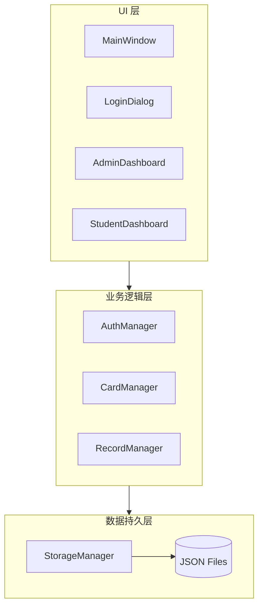
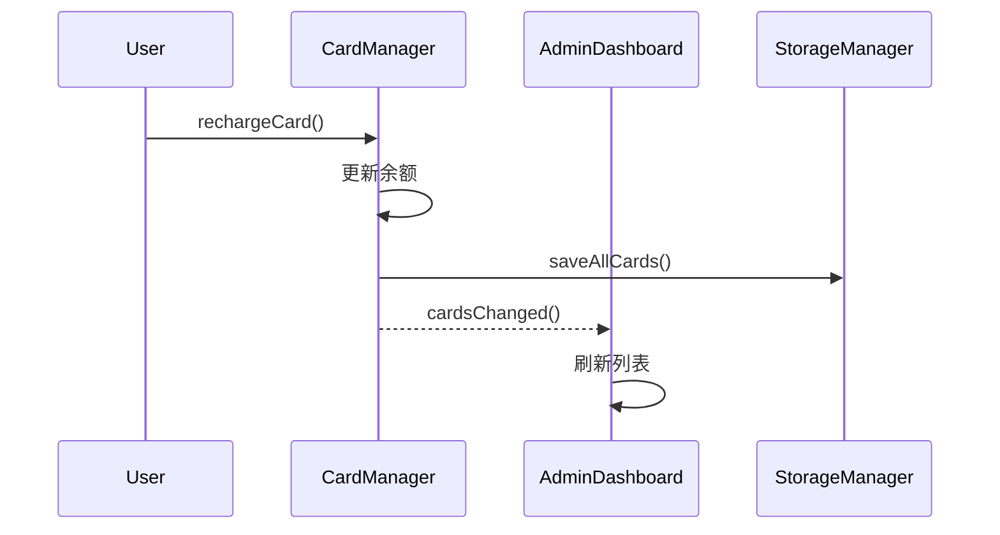
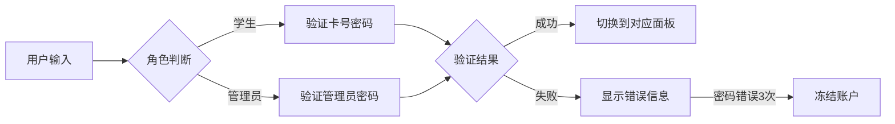
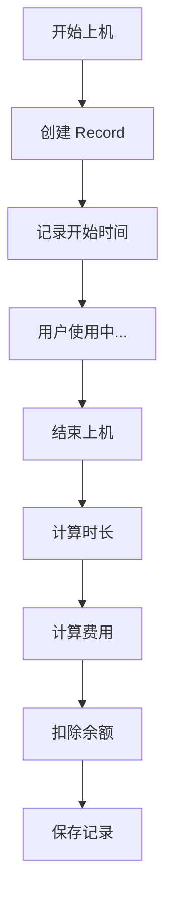

# 系统概述

本文档介绍校园卡管理系统的整体架构设计和核心设计理念。

## 架构概览

系统采用经典的**三层架构**设计，实现了关注点分离和模块化开发。



## 层次职责

### UI 层（Presentation Layer）

负责用户界面展示和用户交互。

| 组件 | 职责 |
|------|------|
| `MainWindow` | 主窗口框架，导航管理 |
| `LoginDialog` | 登录认证界面 |
| `RegisterDialog` | 新卡注册界面 |
| `AdminDashboard` | 管理员控制面板 |
| `StudentDashboard` | 学生操作面板 |
| `RechargeDialog` | 充值对话框 |
| `StatisticsWidget` | 统计报表组件 |
| `RecordTableWidget` | 记录表格组件 |

### 业务逻辑层（Business Logic Layer）

封装核心业务规则和流程控制。

| 组件 | 职责 |
|------|------|
| `AuthManager` | 用户认证、登录状态管理 |
| `CardManager` | 卡片 CRUD、状态管理 |
| `RecordManager` | 上机会话、记录统计 |

### 数据持久层（Data Access Layer）

负责数据的存储和读取。

| 组件 | 职责 |
|------|------|
| `StorageManager` | JSON 文件读写、数据导入导出 |

## 设计模式

### 单例模式（Singleton）

`StorageManager` 采用单例模式，确保全局唯一的数据访问点。

```cpp
class StorageManager {
public:
    static StorageManager& instance() {
        static StorageManager instance;
        return instance;
    }
    
private:
    StorageManager() = default;
    StorageManager(const StorageManager&) = delete;
    StorageManager& operator=(const StorageManager&) = delete;
};
```

### 观察者模式（Observer）

通过 Qt 信号槽机制实现模块间的松耦合通信。



### 依赖注入（Dependency Injection）

Manager 类通过构造函数注入依赖，便于测试和扩展。

```cpp
class AuthManager : public QObject {
public:
    explicit AuthManager(CardManager* cardManager, 
                         QObject* parent = nullptr);
};
```

## 数据流

### 登录流程



### 上机计费流程



## 文件结构

```text
src/
├── core/                    # 核心业务逻辑
│   ├── Types.h              # 全局类型定义
│   ├── Card.h/cpp           # 校园卡实体
│   ├── Record.h/cpp         # 上机记录实体
│   ├── User.h/cpp           # 用户实体
│   ├── AuthManager.h/cpp    # 认证管理
│   ├── CardManager.h/cpp    # 卡片管理
│   ├── RecordManager.h/cpp  # 记录管理
│   └── StorageManager.h/cpp # 存储管理
│
├── ui/                      # 用户界面
│   ├── MainWindow.h/cpp     # 主窗口
│   ├── LoginDialog.h/cpp    # 登录对话框
│   ├── RegisterDialog.h/cpp # 注册对话框
│   ├── AdminDashboard.h/cpp # 管理员面板
│   ├── StudentDashboard.h/cpp # 学生面板
│   ├── RechargeDialog.h/cpp # 充值对话框
│   ├── StatisticsWidget.h/cpp # 统计组件
│   └── RecordTableWidget.h/cpp # 记录表格
│
└── main.cpp                 # 程序入口
```

## 技术选型

| 技术 | 选择 | 理由 |
|------|------|------|
| **语言** | C++20 | 现代特性、类型安全 |
| **GUI** | Qt6 | 跨平台、成熟稳定 |
| **UI 组件** | ElaWidgetTools | Fluent Design、美观现代 |
| **存储** | JSON | 轻量级、易于调试 |
| **构建** | CMake | 跨平台、标准化 |

## 扩展性设计

系统预留了以下扩展点：

1. **数据库支持** - `StorageManager` 可替换为 SQLite/MySQL 实现
2. **网络功能** - 可添加 REST API 层支持远程访问
3. **多语言** - 使用 Qt Linguist 实现国际化
4. **主题切换** - ElaWidgetTools 支持明暗主题

## 下一步

- [核心模块](core-modules.md) - 详细了解核心类
- [UI 组件](ui-components.md) - 了解界面组件
