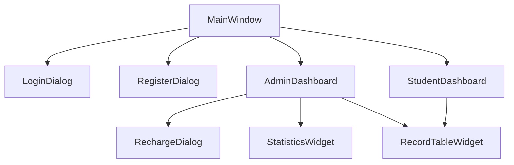

# UI 组件

本文档详细介绍系统的用户界面组件。

## 组件概览

所有 UI 组件基于 [ElaWidgetTools](https://github.com/AstroAir/ElaWidgetTools) 构建，采用 Fluent Design 设计语言。



## MainWindow

主窗口类，继承自 `ElaWindow`。

### 功能

- 侧边栏导航管理
- 页面切换控制
- 搜索建议框
- 登录/登出状态管理
- 关于对话框

### 布局结构

```text
┌─────────────────────────────────────────────────────────┐
│  标题栏  │  搜索框  │  窗口控制按钮                        │
├─────┬───────────────────────────────────────────────────┤
│     │                                                   │
│ 导  │                                                   │
│ 航  │              内容区域                              │
│ 栏  │         (欢迎页/管理员面板/学生面板)                │
│     │                                                   │
│     │                                                   │
├─────┴───────────────────────────────────────────────────┤
│  状态栏                                                  │
└─────────────────────────────────────────────────────────┘
```

### 关键成员

```cpp
// 业务管理器
CardManager* m_cardManager;
RecordManager* m_recordManager;
AuthManager* m_authManager;

// 子界面
LoginDialog* m_loginDialog;
AdminDashboard* m_adminDashboard;
StudentDashboard* m_studentDashboard;

// 搜索
ElaSuggestBox* m_suggestBox;
```

### 导航项

| 导航项 | 图标 | 目标页面 |
|--------|------|----------|
| 主页 | Home | 欢迎页 |
| 管理员 | Admin | 管理员面板 |
| 学生 | User | 学生面板 |
| 关于 | Info | 关于对话框 |

## LoginDialog

登录对话框，继承自 `ElaDialog`。

### 功能

- 角色选择（学生/管理员）
- 凭据输入
- 登录验证
- 错误提示
- 跳转注册

### UI 组件

| 组件 | 类型 | 说明 |
|------|------|------|
| 角色选择 | `ElaComboBox` | 学生/管理员切换 |
| 卡号输入 | `ElaLineEdit` | 学生模式显示 |
| 密码输入 | `ElaLineEdit` | 密码模式 |
| 登录按钮 | `ElaPushButton` | 主操作按钮 |
| 注册链接 | `ElaText` | 跳转注册 |
| 提示标签 | `ElaText` | 显示错误信息 |

### 交互逻辑

1. 选择角色时动态显示/隐藏卡号输入框
2. 登录失败显示剩余尝试次数
3. 账户冻结时显示提示信息

## RegisterDialog

注册对话框，继承自 `ElaDialog`。

### 功能

- 新卡信息录入
- 卡号自动生成
- 密码确认验证

### 输入字段

| 字段 | 必填 | 说明 |
|------|------|------|
| 卡号 | 是 | 可手动输入或自动生成 |
| 姓名 | 是 | 持卡人姓名 |
| 学号 | 是 | 学号 |
| 密码 | 是 | 登录密码 |
| 确认密码 | 是 | 密码确认 |

## AdminDashboard

管理员控制面板，继承自 `QWidget`。

### 功能

- 卡列表展示和搜索
- 实时统计信息
- 卡片管理操作
- 数据导入导出
- 统计报表

### 布局结构

```text
┌─────────────────────────────────────────────────────────┐
│  搜索框  │  当日收入  │  总卡数  │  在线人数  │  日期选择  │
├─────────────────────────────────────────────────────────┤
│                                                         │
│                    卡列表表格                            │
│  (卡号 | 姓名 | 学号 | 余额 | 状态 | 累计充值)           │
│                                                         │
├─────────────────────────────────────────────────────────┤
│ 充值 │ 挂失 │ 解挂 │ 解冻 │ 重置密码 │ 添加新卡 │ 统计   │
│ 导出 │ 导入 │ 生成模拟数据 │ 修改管理员密码 │ 退出登录   │
└─────────────────────────────────────────────────────────┘
```

### 表格列

| 列 | 数据 |
|------|------|
| 卡号 | `cardId` |
| 姓名 | `name` |
| 学号 | `studentId` |
| 余额 | `balance` |
| 状态 | `state`（带颜色标识） |
| 累计充值 | `totalRecharge` |

### 功能按钮

| 按钮 | 功能 | 条件 |
|------|------|------|
| 充值 | 打开充值对话框 | 选中卡 |
| 挂失 | 挂失选中卡 | 选中正常状态卡 |
| 解挂 | 解除挂失 | 选中挂失状态卡 |
| 解冻 | 解除冻结 | 选中冻结状态卡 |
| 重置密码 | 重置密码 | 选中卡 |
| 添加新卡 | 打开注册对话框 | 无 |
| 统计 | 打开统计面板 | 无 |
| 导出 | 导出所有数据 | 无 |
| 导入 | 导入数据文件 | 无 |
| 生成模拟数据 | 生成测试数据 | 无 |
| 修改管理员密码 | 修改密码 | 无 |
| 退出登录 | 登出 | 无 |

## StudentDashboard

学生控制面板，继承自 `QWidget`。

### 功能

- 卡片信息展示
- 上机状态管理
- 历史记录查询
- 使用统计

### 布局结构

```text
┌─────────────────────────────────────────────────────────┐
│  卡片信息区域                                            │
│  姓名: xxx  │  学号: xxx  │  余额: xxx  │  状态: xxx     │
├─────────────────────────────────────────────────────────┤
│  上机状态区域                                            │
│  当前状态: 上机中/离线  │  开始时间  │  地点  │  预计费用  │
│  [开始上机]  [结束上机]                                  │
├─────────────────────────────────────────────────────────┤
│  统计信息                                               │
│  总上机次数: xxx  │  总时长: xxx  │  总费用: xxx         │
├─────────────────────────────────────────────────────────┤
│  上机记录                                               │
│  日期筛选: [开始日期] - [结束日期]  地点筛选: [下拉框]    │
│  ┌─────────────────────────────────────────────────┐   │
│  │  日期  │  开始  │  结束  │  时长  │  费用  │  地点  │   │
│  │  ...   │  ...   │  ...   │  ...   │  ...   │  ...  │   │
│  └─────────────────────────────────────────────────┘   │
└─────────────────────────────────────────────────────────┘
```

### 信息展示

| 区域 | 内容 |
|------|------|
| 卡片信息 | 姓名、学号、余额、状态 |
| 上机状态 | 当前状态、开始时间、地点、预计费用 |
| 统计信息 | 总次数、总时长、总费用 |
| 记录列表 | 历史上机记录表格 |

## RechargeDialog

充值对话框，继承自 `ElaContentDialog`。

### 功能

- 显示卡片当前信息
- 输入充值金额
- 确认充值操作

### 显示信息

- 卡号
- 持卡人姓名
- 当前余额
- 累计充值

## StatisticsWidget

统计报表组件，继承自 `QWidget`。

### 功能

- 日期选择
- 当日统计汇总
- 详细记录列表

### 统计项

| 项目 | 说明 |
|------|------|
| 当日收入 | 所有卡当日费用总和 |
| 上机次数 | 当日上机记录数 |
| 总时长 | 当日上机总分钟数 |

## RecordTableWidget

上机记录表格组件，继承自 `QWidget`。

### 功能

- 显示记录列表
- 支持排序
- 状态颜色标识

### 表格列

| 列 | 数据 | 格式 |
|------|------|------|
| 日期 | `date` | yyyy-MM-dd |
| 开始时间 | `startTime` | HH:mm:ss |
| 结束时间 | `endTime` | HH:mm:ss |
| 时长 | `durationMinutes` | X 分钟 |
| 费用 | `cost` | ¥X.XX |
| 地点 | `location` | 文本 |
| 状态 | `state` | 上机中/已结束 |

## 下一步

- [数据模型](../api/data-models.md) - 查看 JSON 格式
- [信号与槽](../api/signals-slots.md) - 了解事件通信
